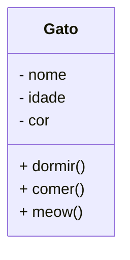

# Introdução à  Programação a objetos.

A programação orientada a objetos prioriza a proximidade das entidades(objetos) do mundo real com as entidades de uma aplicação.

Os objetos do mundo real são abstraídos fielmente, assim como suas relações com outros objetos; facilitando assim o entendimento para com as assoiações fidedignas.

A orientação a objetos também facilita a manutenção, reutilização e organização do código.

Também preenche as lacunas da programação estruturada que utiliza estruturas simplificadas como sequenciação, controle e iteração.

## Classes 

> Classes são estruturas que definem atributos e comportamentos.

As classes são as estruturas que definem tipos de dados personalizados, estes novos tipos definem os objetos do mundo real.

> Exemplo de classe: Gato. Na modelagem UML temos duas seções, a seção superior representa os atributos do objeto; a seção inferior representa os comportamentos que o objeto pode realizar.




### Exemplo em Java

 ```java
public class Gato {
    ...
}
 ```