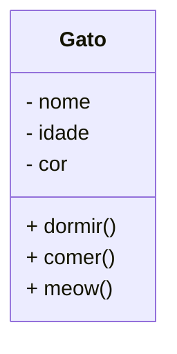

# Introdução à  Programação a objetos.

A programação orientada a objetos prioriza a proximidade das entidades(objetos) do mundo real com as entidades de uma aplicação.

Os objetos do mundo real são abstraídos fielmente, assim como suas relações com outros objetos; facilitando assim o entendimento para com as assoiações fidedignas.

A orientação a objetos também facilita a manutenção, reutilização e organização do código.

Também preenche as lacunas da programação estruturada que utiliza estruturas simplificadas como sequenciação, controle e iteração.

## Classes 

> Classes são estruturas que definem atributos e comportamentos.

As classes são as estruturas que definem tipos de dados personalizados, estes novos tipos definem os objetos do mundo real.

> Exemplo de classe: Gato. Na modelagem UML temos duas seções, a seção superior representa os atributos do objeto; a seção inferior representa os comportamentos que o objeto pode realizar.




### Exemplo em Java

 ```java
package domain;

import java.util.Scanner;

/*
 * Definição de classe em Java
 */
public class Gato {

    //Atributos
    public String nome;
    public Integer idade;
    public String cor;

    //Comportamentos
    public Gato(String nome, Integer idade, String cor) {
        this.nome = nome;
        this.idade = idade;
        this.cor = cor;
    }

    public Gato(String nome) {
        this.nome = nome;
        this.idade = -1;
        this.cor = "não soube informar";
    }

    public Gato() {
        Scanner in = new Scanner(System.in);
        System.out.println("Entre com o nome, idade e cor nesta ordem...");
        this.nome = in.nextLine();
        this.idade = in.nextInt();
        in.nextLine();
        this.cor = in.nextLine();
        in.close();
    }

    public void comer() {
        System.out.printf("%s já comeu!\n", nome);
    }

    public void dormir() {
        System.out.printf("%s está dormindo...\n", nome);
    }

    public void meow() {
        System.out.printf("%s: Meeooooowwwwwwww!\n", nome);
    }

    @Override
    public String   toString() {
        return "Gato [nome=" + nome + ", idade=" + idade + ", cor=" + cor + "]";
    }

}

 ```

 # Hierarquia de Classes

 A orientação a objetos também possibilita a criação de hierarquia de classes que se adequem melhor ao domímio de problema; fazendo com que estruturas mais inteligentes com maior facilidade em reaproveitamento de código possam ser geradas.

 ```mermaid
    classDiagram
        Organism <|-- Animal
        Organism <|-- Plant
        Animal <|-- Mamal
        Plant <|-- Flower
        Mamal <|-- Dog
        Mamal <|-- Lion
        class Organism
        class Animal
        class Mamal
        class Lion
        class Dog
        class Plant
        class Flower
 ```